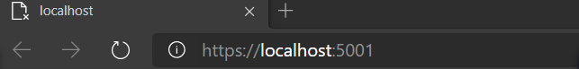
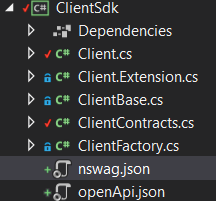
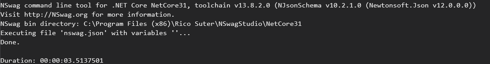
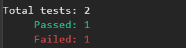

# ReadME

## ClientSdk

* Download [NSwagStudio](https://github.com/RicoSuter/NSwag/wiki/CommandLine) and install  (can use NSwag.MSBuild Nuget Package instead)

* Run ClassTranscribeServer 

  If the connection succeeds, a webpage will jump out. "https://localhost:5001/" is the **base url** of your local client.

  

* In`./WebApi/ClientSdk/nswag.json` file, 

  ```
  "documentGenerator": {
        "fromDocument": {
          "url": "https://localhost:5001/swagger/v1/swagger.json",
          "output": "openApi.json",
          "newLineBehavior": "Auto"
        }
      },
  ```

  Change "url" to your **base url**  + "swagger/v1/swagger.json" 

* In `ClientSdk` folder, run 

  ```c#
  $ nswag run /runtime:NetCore31
  ```

  Then `Client.cs`,  `ClientContracts.cs` and  `openApi.json` will be generated/updated automatically.



* Now ClientSdk is set up. U can call methods in `Client.cs` to test api.

* Every time you updates your api,  run ClassTranscribeServer and run command line below to update your client  

  ```
  $ nswag run /runtime:NetCore31
  ```



## ApiTestFramework

* Go to `ApiTest`  folder

* In `UnitTests.cs`, 

  ```
  Setting.baseUrl = "https://localhost:5001/";
  Setting.ignoreProperties = new List<string>
  {
  	"concurrencyStamp",
  	"securityStamp"
  };
  ```

  Set the baseUrl to your own **base url**

  Set `ignoreProperties` to properties to be ignored when comparing the response and your expectation

  Input test data in `TestData` class.

  * `_token` : Bear token 
  * `_api`: api
  * `_method`: Get / Put / Delete / Post
  * `_input`: parameters of api calls
  * `_expectation`: expected response of api calls

* Uncomment following code 

  ```c#
  //TestCase t = new TestCase(_token, _api, _method, _input, _expectation);
  
//AssertInfo log = t.Run();
  
//Assert.Equal("succeed", log.assert);
  ```

* Run test 

  ```
  $ dotnet test
  ```

  If succeed, you should see

  

  